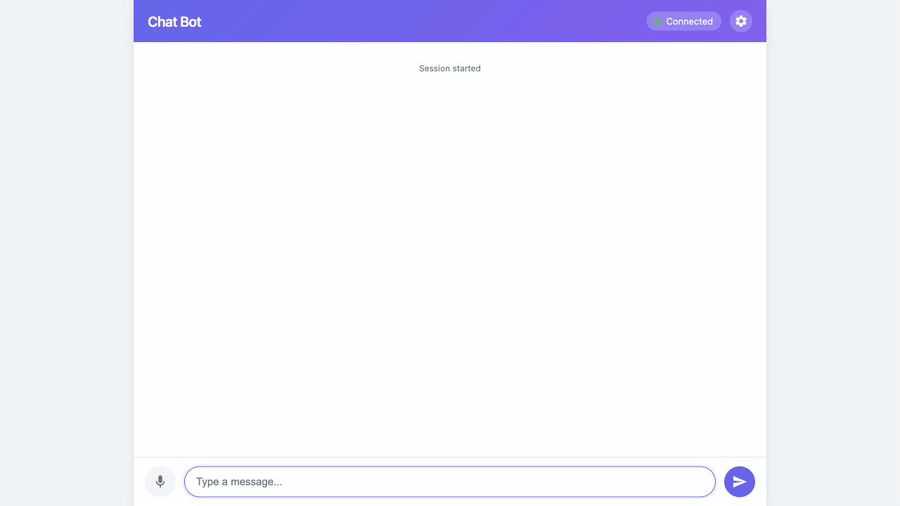
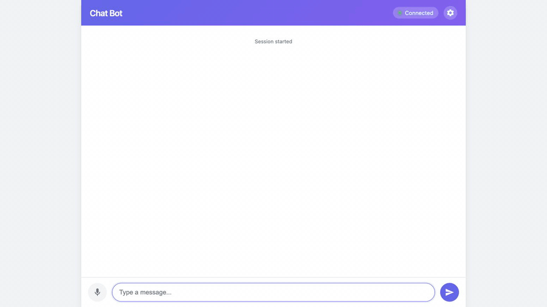
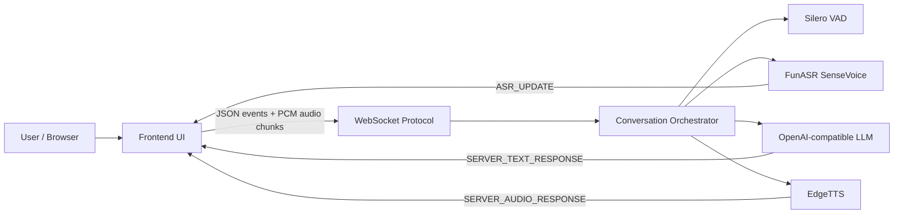

# EchoFlow Voice Agent

一个实时语音 AI 助手 Demo，展示从浏览器麦克风输入到语音回复播放的完整链路：

```text
Browser Audio -> WebSocket -> VAD -> ASR -> LLM -> TTS -> Browser Playback
```

项目当前更适合作为开源/面试展示项目：优先提供浏览器 Web Demo 和本地完整运行说明；Tauri 桌面端保留为实验性外壳，不作为当前主要交付物。

## Demo Preview

下面的 GIF 由本地浏览器自动化录制，展示前端连接后端、进行多轮对话，并逐步接收 AI 回复的效果。



设置面板可以查看后端模块状态，方便展示 ASR/VAD/LLM/TTS 适配器是否被加载。



## Features

- 浏览器端实时输入：前端通过 WebSocket 发送文字、音频块和语音结束事件。
- 后端 VAD：使用 Silero VAD 检测音频块中是否包含语音。
- 后端 ASR：使用 FunASR SenseVoiceSmall 将语音转文字。
- LLM 回复：支持 OpenAI-compatible Chat Completions，可接 OpenRouter、OpenAI 兼容中转站或自建代理。
- TTS 播放：使用 EdgeTTS 将回复文本合成为音频并回传前端播放。
- 流式事件：前后端通过 `ASR_UPDATE`、`SERVER_TEXT_RESPONSE`、`SERVER_AUDIO_RESPONSE` 等事件通信。
- 模块化适配器：ASR、VAD、LLM、TTS、Protocol 都通过 adapter/factory 管理，方便替换实现。
- 本地完整链路可运行：已验证音频输入、ASR、LLM、TTS 全链路。

## Current Status

已验证：

```text
REGISTER SYSTEM_SERVER_SESSION_START True
ASR_UPDATE 派放时间早上九点至下午五点
REPLY 派放时间是早上九点到下午五点。
AUDIO_CHUNKS 30
TEXT_FINAL True
```

这说明当前本地完整语音链路可以跑通：

```text
音频输入 -> VAD -> ASR -> LLM -> TTS -> 前端音频返回
```

当前限制：

- 麦克风按钮现在是“按住说话”：按住按钮录音，松开后识别；普通点一下通常没有足够音频。后续建议改成点击开始/停止录音。
- 前端 WebSocket 地址仍以本地 `localhost:8765` 为主要场景，线上部署前应改成自动使用 `ws://` / `wss://`。
- Tauri 桌面端目前只是实验性外壳，还没有把 Python 后端、模型、配置和启动流程打进安装包。
- 完整语音后端启动较慢，SenseVoice 模型约 900MB，加载后 Python 进程常见内存占用约 1.6GB。

完整问题记录和排查过程见 [RUNNING.md](RUNNING.md)。

## Architecture



核心目录：

```text
backend/
  adapters/
    asr/          FunASR SenseVoice 适配器
    vad/          Silero VAD 适配器
    llm/          LangChain / raw OpenAI-compatible 适配器
    tts/          EdgeTTS 适配器
    protocols/    WebSocket 协议适配器
  core/
    conversation/ 对话编排、打断、分句、TTS 调度
    input/        音频/文本输入处理
    models/       Pydantic 数据模型
    session/      会话管理
  configs/        本地、文本、完整语音示例配置
  scripts/        模型下载脚本

frontend/
  src/            浏览器 UI
  src-tauri/      Tauri 桌面端实验外壳
```

## Requirements

- Python `>=3.13`
- `uv`
- Node.js 和 npm，仅在运行/打包前端桌面壳时需要
- ffmpeg，音频处理和本地调试建议安装
- Rust/Cargo，仅在运行 Tauri 桌面端时需要

说明：

- 当前仓库没有 `requirements.txt`，不要使用旧命令 `pip install -r requirements.txt`。
- 推荐使用 `pyproject.toml` + `uv.lock`。
- Tauri 桌面端需要 Rust/Cargo；这是 Tauri 的开发/打包前置条件，不是 macOS 不能运行。

## Quick Start

进入项目目录：

```bash
cd /path/to/echoflow-voice-agent
```

如果没有全局 `uv`，可以在项目内 bootstrap 一个本地 uv：

```bash
python3 -m venv .cache/uv-bootstrap
.cache/uv-bootstrap/bin/python -m pip install --upgrade pip uv
.cache/uv-bootstrap/bin/uv --version
```

安装完整依赖：

```bash
.cache/uv-bootstrap/bin/uv sync --extra full --extra dev
```

复制环境变量文件：

```bash
cp .env.example .env
```

编辑 `.env`。默认推荐 OpenRouter：

```bash
API_KEY=your-api-key
BASE_URL=https://openrouter.ai/api/v1
MODEL_NAME=openai/gpt-4.1-mini
```

使用 OpenAI-compatible 中转站时，把 `BASE_URL` 和 `MODEL_NAME` 改成服务商提供的值。

下载 ASR/VAD 模型：

```bash
.cache/uv-bootstrap/bin/uv run python backend/scripts/download_models.py
```

启动完整语音后端：

```bash
API_KEY=your-api-key \
BASE_URL=https://openrouter.ai/api/v1 \
MODEL_NAME=openai/gpt-4.1-mini \
.cache/uv-bootstrap/bin/uv run python -m backend.main server \
  --config backend/configs/full_server.openai_compatible.yaml.example
```

启动前端静态页面：

```bash
cd frontend/src
python3 -m http.server 5173 --bind 127.0.0.1
```

浏览器打开：

```text
http://127.0.0.1:5173/
```

使用方式：

1. 确认右上角显示 `Connected`。
2. 文字输入框可直接发送文本消息。
3. 麦克风按钮当前是“按住说话”，需要按住 1-2 秒以上再松开。
4. 第一次使用麦克风时，需要允许浏览器麦克风权限。

## Text-only Demo

如果只想快速看前端和 LLM 回复，不想加载 ASR/VAD/TTS 模型，可以启动文本模式：

```bash
API_KEY=your-api-key \
BASE_URL=https://openrouter.ai/api/v1 \
MODEL_NAME=openai/gpt-4.1-mini \
.cache/uv-bootstrap/bin/uv run python -m backend.main server \
  --config backend/configs/text_server.openai_compatible.yaml.example
```

然后同样启动 `frontend/src` 静态页面。

## Configuration

完整语音示例配置：

```text
backend/configs/full_server.openai_compatible.yaml.example
```

文本模式示例配置：

```text
backend/configs/text_server.openai_compatible.yaml.example
```

最小 WebSocket 启动验证配置：

```text
backend/configs/minimal_server.yaml.example
```

LLM 默认使用 OpenAI-compatible 接口，关键配置如下：

```yaml
model_name: "openai/gpt-4.1-mini"
model_name_env_var: "MODEL_NAME"
api_key_env_var: "API_KEY"
base_url_env_var: "BASE_URL"
base_url: "https://openrouter.ai/api/v1"
raw_openai_compatible: true
```

使用中转站时覆盖环境变量即可：

```bash
BASE_URL=https://your-openai-compatible-endpoint/v1
MODEL_NAME=your-provider-model-name
```

不要把真实 API key 写进仓库。

## Tests

运行单元测试：

```bash
.cache/uv-bootstrap/bin/uv run pytest backend/tests/unit -q
```

当前本地验证结果：

```text
359 passed, 1 skipped
```

运行完整语音链路时，也可以用 WebSocket 冒烟测试确认：

```text
SYSTEM_CLIENT_SESSION_START
CLIENT_TEXT_INPUT 或音频 PCM chunks
ASR_UPDATE
SERVER_TEXT_RESPONSE
SERVER_AUDIO_RESPONSE
```

## Desktop Shell

Tauri 桌面端位于：

```text
frontend/src-tauri
```

当前状态：实验性。

它可以作为后续桌面客户端基础，但当前还不是完整交付物，因为还没有集成：

- Python 后端进程自动启动
- ASR/VAD 模型打包或首次下载
- 本地配置管理
- 自动更新
- macOS 签名/公证
- Windows 安装包签名

如果需要运行 Tauri：

```bash
cd frontend
npm ci
npm run dev
```

如果缺少 Rust/Cargo，会看到类似：

```text
failed to run 'cargo metadata'
No such file or directory
```

安装 Rust/Cargo 后再运行：

```bash
xcode-select --install
curl --proto '=https' --tlsv1.2 https://sh.rustup.rs -sSf | sh
cargo --version
```

## Roadmap

- 将麦克风交互改为点击开始/停止录音
- WebSocket 地址改成根据当前页面自动生成，支持本地 `ws://` 和线上 `wss://`
- 将 Tauri 桌面端标注为 experimental，后续再做完整客户端打包
- 增加更明确的前端错误提示：麦克风权限、WebSocket 未连接、录音过短、TTS/LLM 请求失败

## License

GPL-3.0. See [LICENSE](LICENSE).
